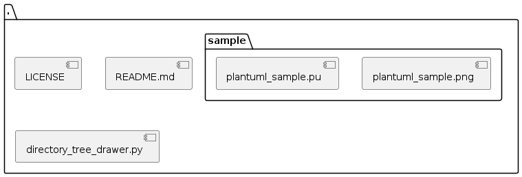

# Directory Tree Drawer

This program converts the directory tree(``tree -J`` command) to the several format(PlantUML, png, etc).

## Prepare

```shell
$ sudo apt install tree
```

## Usage

### PlantUML

```shell
$ python3 directory_tree_drawer.py
```

### PNG

T.B.D

## Result sample

### PlantUML

#### Script

```
@startuml
folder "." {
[LICENSE]
[README.md]
[directory_tree_drawer.py]
folder "sample" {
[plantuml_sample.png]
[plantuml_sample.pu]
}
}
@enduml
```

#### Figure



### PNG

T.B.D

